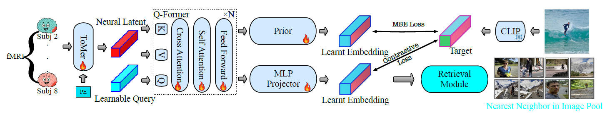

# VoxelFormer: Parameter-Efficient Multi-Subject Visual Decoding from fMRI

**A lightweight transformer architecture for cross-subject brain decoding**

<br>

## Abstract

Recent advances in fMRI-based visual decoding have enabled compelling reconstructions of perceived images. However, most approaches rely on subject-specific training, limiting scalability and practical deployment. **VoxelFormer** is a lightweight transformer architecture that enables multi-subject training for visual decoding from fMRI. VoxelFormer integrates a Token Merging Transformer (ToMer) for efficient voxel compression and a query-driven Q-Former that produces fixed-size neural representations aligned with the CLIP image embedding space.

## Key Contributions

1. **Token Merging Transformer (ToMer)**: Dynamically reduces fMRI token count via learned attention, lowering memory cost while preserving critical information
2. **Query-driven Q-Former**: Produces fixed-size latent representations enabling multi-subject training without subject-specific layers
3. **Parameter Efficiency**: Achieves competitive performance with 39M parameters (12× reduction vs MindEye2, 24× reduction vs MindEye1)

## Installation

1. Clone this repository:

```bash
git clone https://github.com/kushagrayadv/voxel-former.git
cd voxel-former
```

2. Run setup script to install the "fmri" virtual environment:

```bash
bash setup.sh
source fmri/bin/activate
```

3. Install additional dependencies:

```bash
pip install -r requirements.txt
pip install git+https://github.com/openai/CLIP.git --no-deps
```

## Architecture Overview

VoxelFormer consists of two main components working in sequence:

### 1. ToMer (Token Merging Transformer) Encoder
- **Tokenization**: Uses 1×1 convolutional layer to tokenize input voxel data
- **Positional Encoding**: SIREN-based positional embeddings from 3D voxel coordinates
- **Self-Attention**: Captures relationships among voxel tokens
- **Token Merging**: Dynamically merges highly correlated tokens during training and inference
- **Progressive Compression**: Multiple ToMer blocks progressively reduce token count

### 2. Q-Former (Query-Former) 
- **Fixed-size Output**: Produces consistent representations regardless of input voxel count
- **Cross-Attention**: Learnable query tokens attend to compressed ToMer features
- **Multi-Subject Training**: Enables training across subjects without subject-specific layers
- **CLIP Alignment**: Aligns brain representations with CLIP image embedding space

### 3. Dual-Pathway Decoding
- **Prior Transformer**: MSE loss alignment with CLIP embeddings for potential image generation
- **MLP Projector**: Contrastive learning for robust image retrieval via nearest-neighbor search

## Usage

*Note* - The configuration for the dataset paths, model parameters and training parameters are under the ``Downtstream/conf`` directory with respective sub-directories. 

### Training

```bash
# Multi-subject training on NSD subjects 2-7
python Downstream/Train.py \
    --model.encoder_hidden_dim=1024 \
    --model.decoder_hidden_dim=4096 \
    --model.nat_depth=4 \
    --model.num_heads=8 \
    --model.nat_num_neighbors=5 \
    --train.batch_size=24 \
    --train.max_lr=3e-4 \
    --train.num_epochs=150 \
    --data.multi_subject=[2,3,4,5,6,7]
```

### Inference

```bash
# Run image retrieval inference
python Downstream/inference.py
```

### SLURM Job Generation

```bash
# Generate training jobs for HPC
python slurm_job_generator.py

# Generate inference jobs
python slurm_inference_job_generator.py
```

## Dataset

VoxelFormer is evaluated on the **7T Natural Scenes Dataset (NSD)**:
- 8 subjects with high-resolution whole-brain fMRI
- 30-40 sessions per subject viewing natural scene images from MS-COCO
- Training: Subjects 2-7 (multi-subject training)
- Evaluation: Standard top-1 retrieval with 300-image candidate pool

## Data Requirements

### Input Format
- **fMRI Voxels**: 3D brain activation patterns from visual cortex (~10K-20K voxels per subject)
- **Coordinates**: 3D spatial coordinates for each voxel (x, y, z)
- **Images**: Natural scene stimuli from MS-COCO dataset
- **CLIP Features**: Precomputed CLIP embeddings (optional for faster training)

### Expected Data Structure
```
data/
├── nsd_data/
│   ├── voxels/              # Subject-specific voxel activations
│   ├── coordinates/         # 3D voxel coordinate mappings
│   ├── images/              # MS-COCO stimulus images  
│   └── clip_embeddings/     # Precomputed CLIP features
├── subjects/
│   ├── subj02/
│   ├── subj03/
│   └── ...
└── metadata/
    ├── sessions.json
    └── stimulus_mapping.json
```

## HPC Usage

### Environment Setup
```bash
# Interactive A100 session
srun -t 4:00:00 --mem=64000 --gres=gpu:a100:1 --pty /bin/bash

# Load modules
module purge
module load cuda/11.6 cudnn/8.4.0
```

### Singularity Container
```bash
singularity exec --nv \
    --overlay /scratch/overlay.ext3:ro \
    /scratch/containers/pytorch_22.08.sif \
    /bin/bash -c "source /ext3/env.sh && python Downstream/Train.py [args]"
```

## Evaluation Metrics

VoxelFormer uses standard brain decoding evaluation metrics:

- **Top-1 Retrieval Accuracy**: Percentage of correctly retrieved images from 300-image pool
- **Forward Retrieval**: Using brain embeddings to find matching images  
- **Backward Retrieval**: Using image embeddings to find matching brain responses
- **Cosine Similarity**: Alignment between brain-derived and CLIP embeddings
- **Parameter Count**: Total trainable parameters for efficiency comparison

**Chance Level**: 0.33% (1/300 images)

## Citation

If you use VoxelFormer in your research, please cite our paper:

```bibtex
@article{le2024voxelformer,
  title={VoxelFormer: Parameter-Efficient Multi-Subject Visual Decoding from fMRI},
  author={Le, Chenqian and Zhao, Yilin and Emami, Nika and Yadav, Kushagra and Liu, Xujin Chris and Chen, Xupeng and Wang, Yao},
  journal={IEEE Conference Proceedings},
  year={2024},
  organization={New York University Tandon School of Engineering}
}
```

## Acknowledgments

- Built upon the **Natural Scenes Dataset (NSD)** from Allen et al.
- Incorporates **CLIP** vision-language representations from OpenAI
- Inspired by **MindEye** and **MindEye2** project and repo for brain decoding
- Uses **Token Merging (ToMe)** techniques for efficient transformer computation